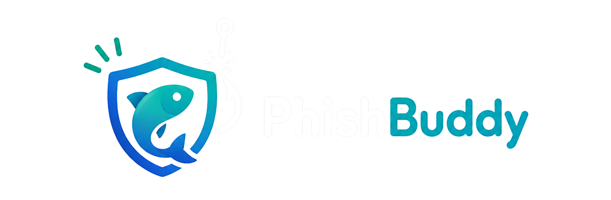

<p align="center">
  
</p>

<h1 align="center">PhishBuddy</h1>

<p align="center">
  <em>Check a link before you open it. Get one clear answer: clean, suspicious, or dangerous.</em>
</p>

<p align="center">
  <a href="LICENSE"></a>
  = 20">
  
  
</p>

---

PhishBuddy is a source-available phishing link checker for desktop browsers. The current codebase contains a Chrome and Firefox extension, shared URL safety logic, and a Convex backend that returns one of three plain-language verdicts:

| Verdict | Meaning |
| --- | --- |
| `clean` | No configured check produced a warning. |
| `suspicious` | Something looks unusual or risky, but nothing is confirmed. |
| `dangerous` | A trusted safety source or strong signal says do not open it. |

The project is intentionally focused on a small MVP: check a URL, combine available safety signals, and show a short reason that a normal user can understand. It is not a replacement for browser protections, password managers, security awareness, or endpoint security tools.

> [!IMPORTANT]
> **PhishBuddy is a helper, not a guarantee.** No automated checker can catch
> every threat. A `clean` result means no configured check raised a warning —
> it does **not** prove a link is safe. Always use your own judgment before
> entering passwords, payment details, or personal information. PhishBuddy is
> provided without warranty and its authors are not liable for missed threats
> or for any loss arising from its use. See [License](#license) for full terms.

## Current MVP Status

Implemented in this repository:

- Shared TypeScript core for URL normalization, lookalike-domain detection, provider checks, and verdict combination.
- Convex backend action and HTTP endpoint at `POST /check-url`.
- Cache table for recent URL results.
- Public Convex domain index for verified, watchlist, and blocked domain labels.
- Pending link-report intake for community or extension-submitted review requests.
- Browser extension source for Chrome Manifest V3 and Firefox Manifest V2.
- Polished extension popup, active-tab checks, optional manual URL checks, page-risk heuristics, background navigation checks, and warning page assets.
- Unit tests for core logic and extension JavaScript modules.
- Build scripts that prepare unpacked Chrome and Firefox extension folders under `dist/extension`.

Provider integrations currently supported by the backend code:

- Google Safe Browsing
- VirusTotal
- Local lookalike-domain heuristics for a small protected-domain list
- Short-lived Convex cache

Planned later platforms are documented in [docs/roadmap.md](docs/roadmap.md). The active implementation focus is still the desktop browser MVP.

## Roadmap

PhishBuddy is built one platform at a time, smallest useful product first. Each
new platform reuses the same PhishBuddy Safety Service so results stay
consistent everywhere.

| Phase | Platform | Status | Goal |
| --- | --- | --- | --- |
| 1 | **Desktop browser (Chrome & Firefox)** | 🟢 In progress (MVP) | Check links in the browser and return Clean / Suspicious / Dangerous with a plain reason. |
| 2 | **Telegram bot** | ⚪ Planned | Let users check links received in Telegram chats, using the same safety service. |
| 3 | **Web app & Android app** | ⚪ Planned | A place to check links outside the browser, shaped around the same simple result. |
| 4 | **iOS & Safari** | ⚪ Researching | Investigate the best iOS flow (share extension, Safari web extension, or app) and App Store requirements. |

What each later phase still needs to decide:

- **Telegram:** bot command flow, rate limiting, and how results are formatted
  in chat.
- **Web & Android:** whether accounts are required, how much link history to
  keep, privacy controls, and Android packaging.
- **iOS & Safari:** the final product shape, Safari web-extension packaging, App
  Store review requirements, and the link-sharing flow.

Later platforms are not started ahead of the browser MVP unless the project
owner changes the order. See [docs/roadmap.md](docs/roadmap.md) for the full
plan and [docs/blueprint.md](docs/blueprint.md) for the product direction.

## Architecture Overview

```text
Browser extension
  -> POST { url } to Convex HTTP Actions URL /check-url
    -> Convex action normalizes the URL
    -> checks public domain labels and cachedUrlResults
    -> runs lookalike, Google Safe Browsing, and VirusTotal checks
    -> combines signals into clean/suspicious/dangerous
  <- JSON safety result with reasons and signals
```

Main boundaries:

- `extension/` contains browser UI, extension manifests, and client-side JavaScript.
- `core/` contains reusable TypeScript safety logic used by Convex and covered by tests.
- `convex/` contains the backend HTTP routes, Convex actions, public domain index, report intake, cache, and schema.
- `scripts/` contains build, package, and test orchestration scripts.

The browser extension does not contain provider API keys. It calls the PhishBuddy Convex HTTP Actions service; Google Safe Browsing and VirusTotal keys stay in Convex environment variables.

## Repository Layout

```text
.
+-- convex/
|   +-- checkUrl.ts           # Convex action plus cache query/mutation
|   +-- http.ts               # HTTP routes for checks, public records, and reports
|   +-- schema.ts             # cache, public domain index, and report tables
+-- core/
|   +-- providers.ts          # Google Safe Browsing and VirusTotal clients
|   +-- similarity.ts         # lookalike-domain detection
|   +-- url.ts                # URL normalization helpers
|   +-- verdict.ts            # signal-to-verdict logic
+-- docs/
|   +-- blueprint.md          # product and system direction
|   +-- roadmap.md            # phased platform plan
+-- extension/
|   +-- manifest.chrome.json  # Chrome MV3 manifest source
|   +-- manifest.firefox.json # Firefox MV2 manifest source
|   +-- src/                  # extension runtime scripts
|   +-- __tests__/            # extension module tests
+-- scripts/
|   +-- build-extension.mjs
|   +-- list-domains.mjs
|   +-- package-extension.mjs
|   +-- run-tests.mjs
|   +-- upsert-domain.mjs
+-- .env.example
+-- package.json
+-- tsconfig.json
```

Generated output:

- `dist/extension-source` is created by `npm run build:extension`.
- `dist/extension/chrome` and `dist/extension/firefox` are created by `npm run package:extension`.

## Prerequisites

- Node.js `>=20`
- npm
- A Convex project/deployment for backend development or extension testing against a live safety service
- Provider API keys if you want Google Safe Browsing and VirusTotal checks to run instead of being reported as skipped

Install dependencies:

```powershell
npm install
```

## Environment Variables

Start from the example file:

```powershell
Copy-Item .env.example .env
```

Variables currently documented by the repository:

| Variable | Used by | Purpose |
| --- | --- | --- |
| `PHISHBUDDY_API_BASE_URL` | Local/developer configuration and extension setup reference | Convex HTTP Actions base URL, for example `https://your-deployment.convex.site`. |
| `GOOGLE_SAFE_BROWSING_API_KEY` | Convex/backend runtime | Enables Google Safe Browsing provider checks. |
| `VIRUSTOTAL_API_KEY` | Convex/backend runtime | Enables VirusTotal provider checks. |
| `PHISHBUDDY_MAINTAINER_TOKEN` | Convex/backend runtime and local maintainer scripts | Authorizes trusted maintainers to update public domain labels. Use a long random value and never commit it. |
| `PHISHBUDDY_CACHE_TTL_SECONDS` | Reserved example setting | Not currently read by the runtime. The backend uses a 15-minute constant in `convex/checkUrl.ts`. |

Do not put provider keys into the extension source or commit real secrets. Configure backend secrets through the Convex environment for the deployment that handles safety checks.

## Development Commands

Run the test suite:

```powershell
npm test
```

Run TypeScript checks:

```powershell
npm run typecheck
```

Build extension source files:

```powershell
npm run build:extension
```

Create unpacked Chrome and Firefox extension folders:

```powershell
npm run package:extension
```

Run the default build script:

```powershell
npm run build
```

Convex helper scripts:

```powershell
npm run convex:dev
npm run convex:deploy
```

Domain index helper scripts:

```powershell
npm run domains:list
npm run domains:list -- watchlist
npm run domains:upsert -- github.com verified "Official GitHub domain" manual-review
npm run domains:upsert -- suspicious-login.example watchlist "Reported for review" community-report
npm run domains:upsert -- phishing.example blocked "Confirmed phishing campaign" provider-review
```

## Browser Extension Installation

Build the unpacked extension folders first:

```powershell
npm run package:extension
```

Chrome:

1. Open `chrome://extensions`.
2. Enable Developer mode.
3. Choose "Load unpacked".
4. Select `dist/extension/chrome`.
5. Reload the extension after each new package build.

Firefox:

1. Open `about:debugging#/runtime/this-firefox`.
2. Choose "Load Temporary Add-on".
3. Select `dist/extension/firefox/manifest.json`.
4. Reload the temporary add-on after each new package build.

The popup checks the active tab automatically. The "Check different site" button reveals a manual URL form for links the user does not want to open. The extension sends URL checks to:

```text
{PHISHBUDDY_API_BASE_URL}/check-url
```

The expected request body is:

```json
{ "url": "https://example.com" }
```

## Convex Backend Notes

The Convex backend exposes a CORS-enabled HTTP route in `convex/http.ts`:

- `OPTIONS /check-url`
- `POST /check-url`
- `GET /domains`
- `OPTIONS /domains`
- `POST /reports`
- `OPTIONS /reports`
- `POST /maintainer/domains`
- `OPTIONS /maintainer/domains`

`POST /check-url` expects JSON with a string `url` field. It calls `api.checkUrl.checkUrl`, which:

- normalizes the submitted URL,
- checks the public domain index,
- checks `cachedUrlResults` for a non-expired result,
- blocks immediately if the domain is listed as `blocked`,
- runs lookalike-domain detection,
- checks Google Safe Browsing and VirusTotal when keys are configured,
- applies `verified`, `watchlist`, or `blocked` labels to the final verdict,
- stores a cached result,
- returns a `SafetyResult`.

`GET /domains` returns public domain records. These records are safe to publish because they contain only domain, label, public reason, and update time.

`POST /reports` accepts public link reports and stores them as `pending`. Reports do not change user-facing verdicts until reviewed.

`POST /maintainer/domains` updates public labels and requires `Authorization: Bearer <PHISHBUDDY_MAINTAINER_TOKEN>`. Use this for trusted maintainer workflows only.

The cache, public domain index, and report schemas are defined in `convex/schema.ts`.

For local Convex development, use:

```powershell
npm run convex:dev
```

Before deploying, make sure provider keys are configured in Convex and the local tests/type checks pass.

## Contributing

Read [CONTRIBUTING.md](CONTRIBUTING.md), [docs/blueprint.md](docs/blueprint.md), and [docs/roadmap.md](docs/roadmap.md) before changing product behavior or platform direction.

Contribution guidelines:

- Keep pull requests small and focused.
- Preserve the current MVP focus unless the project direction changes.
- Add or update tests for behavior changes.
- Keep user-facing safety language plain and specific.
- Avoid unrelated cleanup in feature or bug-fix pull requests.
- Do not overwrite concurrent work from other contributors or agents.

Useful checks before opening a pull request:

```powershell
npm test
npm run typecheck
npm run package:extension
```

## Security and Privacy Notes

- Treat submitted URLs as sensitive data. URLs can reveal accounts, workplaces, private messages, tokens, or personal activity.
- Do not commit API keys, tokens, secrets, private Convex configuration, or packaged credentials.
- Provider API keys belong in the backend environment, not in browser extension files.
- Public domain records must not include provider raw responses, maintainer tokens, submitter identities, private report notes, or sensitive URL paths.
- Public reports are accepted as pending review items only. Never let an unreviewed public report automatically mark a domain as blocked.
- The current backend stores cached URL results in Convex to reduce repeat provider calls. Review retention behavior carefully before production use.
- The current CORS policy in `convex/http.ts` allows all origins. That is practical for extension development, but production deployments should review access controls and abuse prevention.
- A `clean` result means no configured check produced a warning. It does not prove that a URL is safe.
- Provider failures, missing keys, and rate limits are represented as provider signals; they should not be hidden in user-facing behavior.

## License

PhishBuddy is **source-available**, licensed under the
[PolyForm Noncommercial License 1.0.0](LICENSE).

In plain language:

- ✅ You may **use, study, modify, and share** PhishBuddy for any
  **noncommercial** purpose — personal use, research, education, hobby
  projects, and use by nonprofit, educational, public-safety, or government
  organizations.
- ✅ You are **welcome to contribute** improvements back to the project.
- ❌ You may **not** use PhishBuddy, or works based on it, for a **commercial
  purpose** — including selling it, reselling it, or offering it as a paid or
  revenue-generating product or service — without a separate commercial
  license from the copyright holder.

This is intentional. PhishBuddy is meant to stay open to contributors and free
for the people who need it, while preventing others from repackaging and
selling the work.

For commercial licensing inquiries, contact the copyright holder,
**Mirza Gamal Abdel Nasser**, through the
[project repository](https://github.com/Ivan-Ryukendo/PhishBuddy).

The PolyForm Noncommercial License includes a full **no-warranty** and
**no-liability** disclaimer. See [LICENSE](LICENSE) for the binding terms; the
summary above is provided for convenience and is not a substitute for the
license text.
